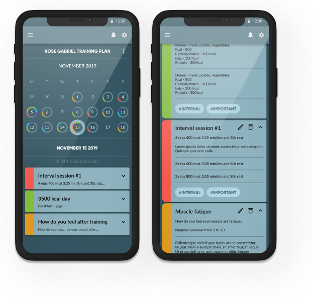

# Sport App

### Application for coaching athletes



## General Info

Application to create training and nutrition plans. Analysis of data collected from training. Creating a board with notes.
For managing state I used Redux (ngrx).

## Tech info

- The sports app is written in **Angular 7**.
- Authentication and authorization was implemented using **auth0.js**.
- I used the **redux** (**ngrx**) library to manage the state of the application.
- Design of the application using google **material**.
- When creating the calendar, I used the **moment.js** library. I used **Highcharts** to display the charts.
- **Angular SDK** helped me create **drag and drop** functionality.

## Technologies

- angular 7
- ngrx
- angular material
- lodash
- moment.js
- highcharts
- auth0.js
- SASS

## Setup

To run this project, install it locally using npm:

```
$ npm install
$ ng serve
```

## Link to REST API

[rest api](https://github.com/matigrzegor/sport-api)

## Link to app

[sport app](https://serene-kare-990ab9.netlify.app/)

## Test account for the application:

Email: testsportapptest@gmail.com
Login: TestApp1!
